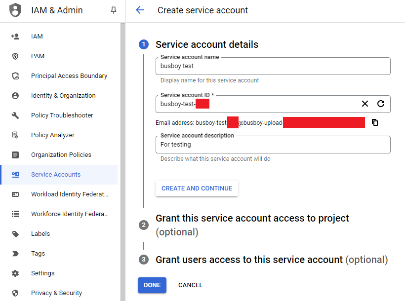
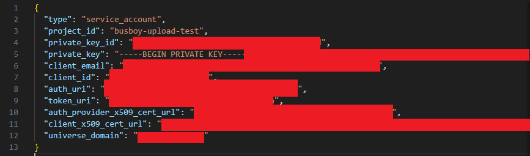
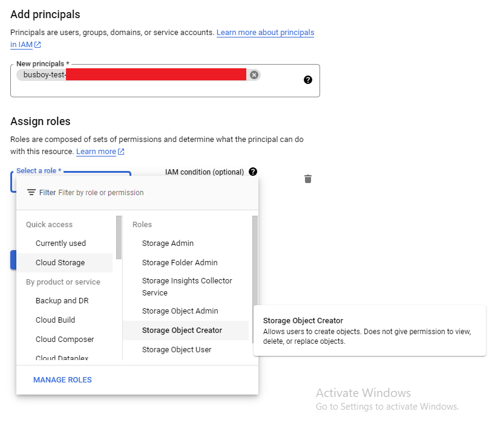

# Busboy-uploading-file-to-several-storage-services

> Busboy is a node.js module for parsing incoming HTML form data. Instead of storing intermediate files in memory or local hard disk, it provides a stream to the incoming file.\
> This instruction helps you use Busboy to upload file to several storage servies and provides some examples code for better understanding

- [Cloudinary](#i-cloudinary)
- [Google Cloud](#ii-google-cloud)

<b>If you find this repository useful, please click star button to give me the motivation to keep this work up-to-date. Thanks so much. </b>

## I. Cloudinary

1. Create a Cloudinary account

2. Access `Programmable Media` > `Dashboard`

3. Get `Cloud name` and click button `Go to API Keys`
 

 

4. Get `API Key` and `API Secret`
 

 

5. Example code for Cloudinary, click [here](routes/cloudinary.js)

## II. Google Cloud

1. [Select or create a Cloud Platform project](https://console.cloud.google.com/project).

2. [Enable billing for your project](https://support.google.com/cloud/answer/6293499#enable-billing).

3. [Enable the Google Cloud Storage API](https://www.npmjs.com/package/@google-cloud/storage#:~:text=Enable%20the%20Google%20Cloud%20Storage%20API.).

4. Set up authentication.

- In [Service Account](https://console.cloud.google.com/iam-admin/serviceaccounts), click on `Create service account`.Then, fill out `Service account details` and click `Done`.
 

 

- In [Service Account](https://console.cloud.google.com/iam-admin/serviceaccounts) dashboard, access newly created account. In `KEYS` tab, click on `Create new key`, choose `Key type` as `JSON`, then click `Create`, download the JSON key file as below :
 

 

- In [Cloud Storage](https://console.cloud.google.com/storage), create a bucket. In `Permission` tab of newly created bucket, click ` Grant Access`. In field `New principals`, copy Email from account above and in field `Assign roles`, select `Storage Object Creator`.
 

 

5. Example code for Google Cloud, click [here](routes/googleCloud.js)
    
