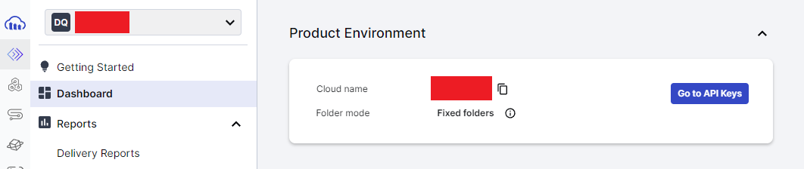
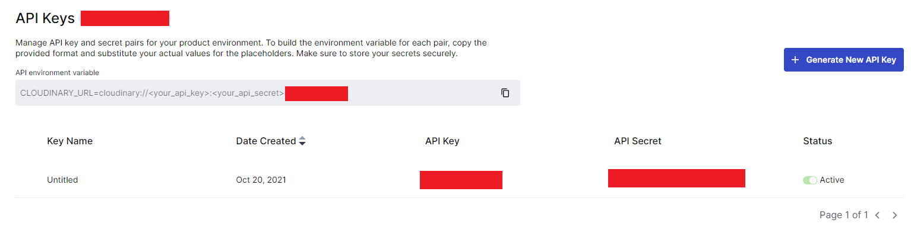

# Busboy-uploading-file-to-several-storage-services

> Busboy is a node.js module for parsing incoming HTML form data. Instead of storing intermediate files, it provides a stream to the incoming file.\
> This instruction helps you use Busboy to upload file to several storage servies and provides some examples code for better understanding

## I. Cloudinary

1. Create a Cloudinary account

2. Access `Programmable Media` > `Dashboard`

3. Get `Cloud name` and click button `Go to API Keys`
 

 

4. Get `API Key` and `API Secret`
 

 

5. Example code for Cloudinary, click [here](routes/cloudinary.js)

 
<b>This instruction is being updated.</b>
 
 
<b>If you find this repository useful, please click star button to give me the motivation to keep this work up-to-date. Thanks so much. </b>
